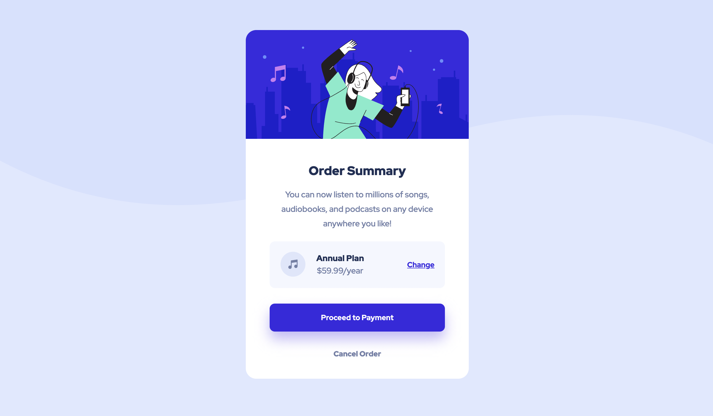

# Frontend Mentor - Order summary card solution

This is my solution to the [Order summary card challenge on Frontend Mentor](https://www.frontendmentor.io/challenges/order-summary-component-QlPmajDUj). Frontend Mentor challenges help you improve your coding skills by building realistic projects.

## Table of contents

- [Overview](#overview)
  - [The challenge](#the-challenge)
  - [Screenshot](#screenshots)
  - [Links](#links)
  - [Still to resolve](#issues-still-to-resolve)
  - [Style Guide](#style-guide)
- [My process](#my-process)
  - [Built with](#built-with)
  - [What I learned](#what-i-learned)
  - [Continued development](#continued-development)
  - [Useful resources](#useful-resources)
- [Author](#author)

## Overview

### The challenge

Users should be able to:

- See hover states for interactive elements

### Screenshots

### Links

- Solution URL: [https://github.com/aheyhey/order-summary-component](https://github.com/aheyhey/order-summary-component)
- Live Site URL: [https://aheyhey.github.io/order-summary-component/](https://aheyhey.github.io/order-summary-component/)

### Issues still to resolve ❗️

- I coded and tested everything using Atom Editor and a browser - when I manually input new code and updated the css on Github, the code broke unexpectedly, something to do with the browser settings itself?
- Seems to be a delay (several minutes) on Github pages updating whenever I made any commits, don't like that the changes are not instantaneous, ruins workflow
- Can't seem to retain filter: drop-shadow(0 20px 1em #e1defb); when hovering over "Payment Summary" is ignored
- Don't know which height to set for mobile and desktop, but it seems to be needed for flexbox center position to work
- Fine-tuning the fonts, haven't subscribed to pro yet so don't have access to the design files

### Style Guide

Inspired by [MDN's guidelines](https://developer.mozilla.org/en-US/docs/MDN/Guidelines/Code_guidelines/CSS#use_mobile_first_media_queries)

- Order of classes and corresponding properties
Classes for each section (debugging, general, component etc.) is listed that we see them on the final webpage - top to bottom, left to right
Major sections are listed starting from biggest box to smallest (outside to inside)
Any specific styles related to a class is listed right underneath instead of collecting all similar selectors together
?? Not sure how to organise:
- multiple selectors that share the same properties and values, but I've just added them after the code for the individual selector
- multiple selectors from different sections that share the same properties and values, in this case, I've added the code right after the last selector

Opting for readability
- Expanded syntax
- Multiple selectors on separate lines
- Comments placed on separate lines preceding the code they are referring to
- Longhand rules over terse shorthand - easier for me as I'm still a beginner at all this
- Set px instead of relative sizes for component box as resizing the desktop window will break the parts in an unreadable way
- maybe there's a way around but at the moment I think it's easier to see

## My process

### Built with

- Semantic HTML5 markup
- CSS custom properties
- Flexbox
- CSS Grid
- Mobile-first workflow

### What I learned

- That I really enjoy being given a bunch of aesthetic pre-made parts to put them together into a whole.
It can be a bit frustrating when the code breaks, though, but I think this can be resolved by establishing a process for debugging.

- That I'm motivated to learn more and better when I'm building towards a final product.
  - I wanted to hit the ground running by going headlong into my first mini project before I felt completely ready. I preferred to hunt for the answers and learn knowledge that's relevant to the problem at hand rather than doing a sequence and series of breadcrumbed exercises without seeing practical use cases for any of them in a meaningful project. I've tried this method before encountering Frontend mentor and felt disengaged and unsatisfied. I went forward with the knowledge I had so far and when I was struggling did I go back several steps to learn some more before reattempting again.

- The importance of actually planning and studying the problem before rushing headlong into the coding (I was pretty eager to start building and had to go back in the middle of to re-examine how to divide up the boxes in the best way)

- The importance of mobile first workflow - before this I had coded for desktop first, because that's my preference for browsing the web. However, I've recently encountered a convincing essay on why we should always develop for [mobile first](http://mobile-first.abookapart.com/).

- Version control using Git and how to display and host websites with GitHub - I had no idea you can host websites directly off of this which is completely amazing!

- Using Flexbox and intro to CSS layout

### Continued development

- Identifying correct font stylings
I think I probably spent the most time fine-tuning whether a font is bolded or not, the picture seemed to change whenever I looked at it again

- More understanding and implementation of version control
I coded this component mostly just the atom editor and browser. When it was close to the time where I had to publicly share the code, I manually updated in Github.

  - I think I didn't feel the need to use version control because the project is so small. I understand the necessity of save points but looking at the terminal is still kind of intimidating and overwhelming. I still don't get what Homebrew is exactly - I think I've installed it??

  - I don't know how specific I need to be with describing commit changes?

- How to optimise and clean up code better for future management and collaboration
  - I was introduced to the style guide, and wrote one to articulate to myself the logic in organisation as well as for others who may want to check my code on Frontend Mentor. There are still some things I'm unsure about though.

  - Better naming e.g. order-box vs order-summary, easy to forget which box is which

- How to use [dev tools](https://developer.mozilla.org/en-US/docs/Learn/CSS/Building_blocks/Debugging_CSS) 
  - I developed the mobile version using a rough workaround in Microsoft Edge browser. The browser window wouldn't shrink to around 375px but it got close enough to the design brief.

- Start learning how to use pre-processors & post-processors, but I figure this may be a bit more down the line when I'm a bit more comfortable with code

- [Colour management](https://abookapart.com/products/making-sense-of-color-management)

### Useful resources

- [HTML & CSS is hard](https://www.internetingishard.com/html-and-css/)
Even though it hasn't been updated since 2017, it got me working straightaway in a code editor and using a browser so I could familiarise myself with working in a workspace that others use. With other sources where the editor is embedded into the specific mini challenge and already pre-populated I felt like I was being given information on a spoon and was too piecemeal to make sense of everything in the bigger picture.

- [MDN](https://developer.mozilla.org/en-US/)
Internetting is hard referred back to this source so many times so started using this database and going through their tutorials, very comprehensive.

- [Codepip](https://codepip.com/)
This is still like those piecemeal exercises I dislike but playing an interactive the Flexbox Froggy game when I felt like I wasn't really understanding layout helped me visualise the properties a bit better

## Author

- Website - Currently in development!
- Frontend Mentor - [@aheyhey](https://www.frontendmentor.io/profile/aheyhey)
